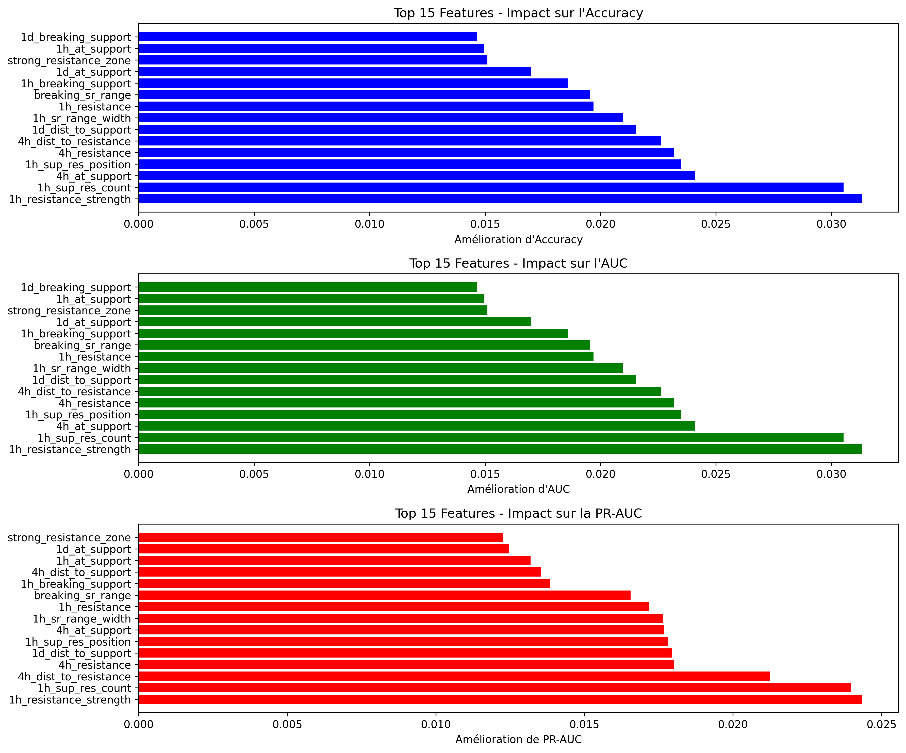
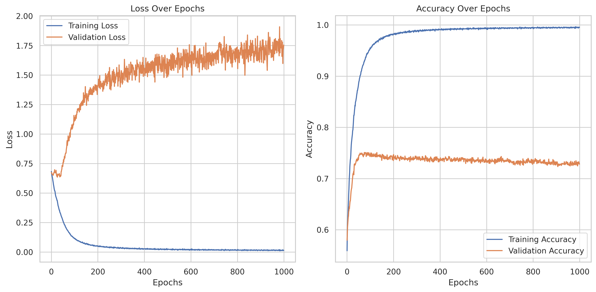
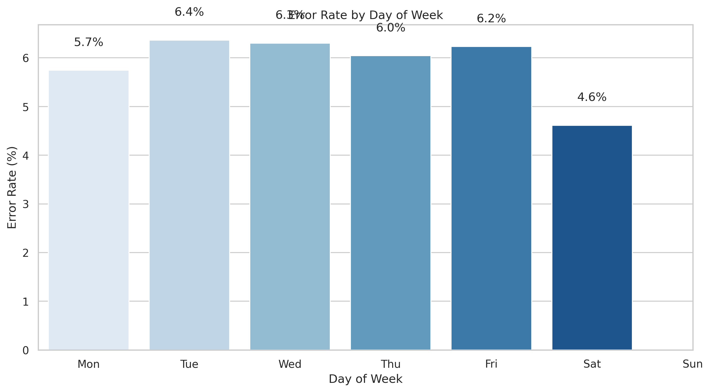
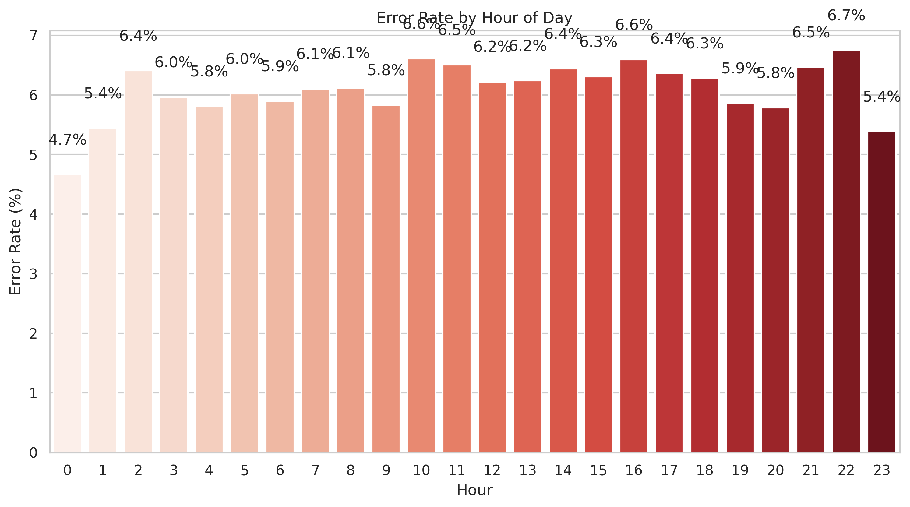
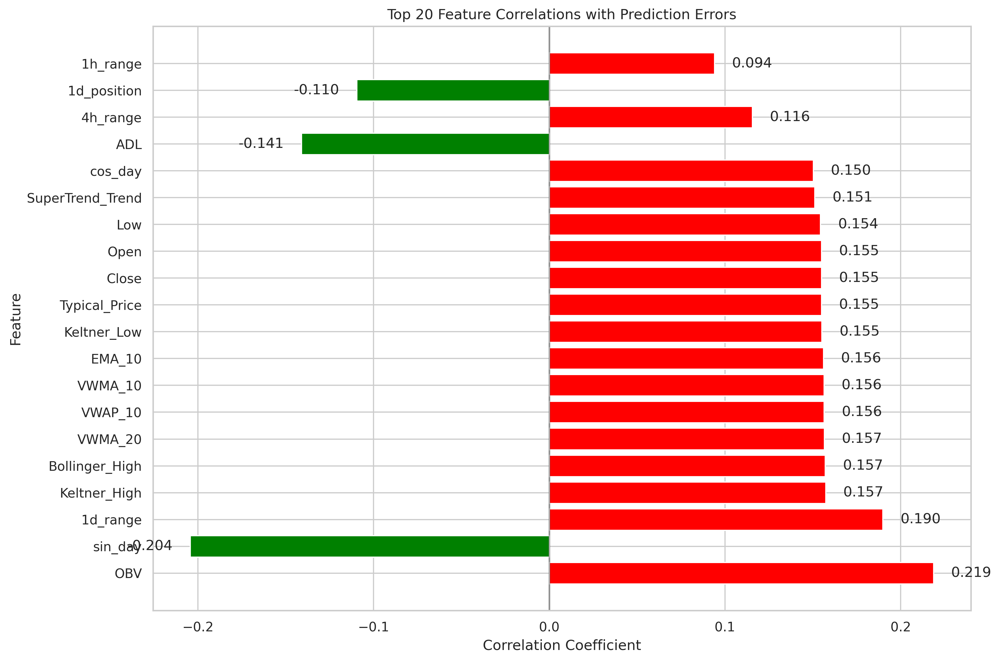
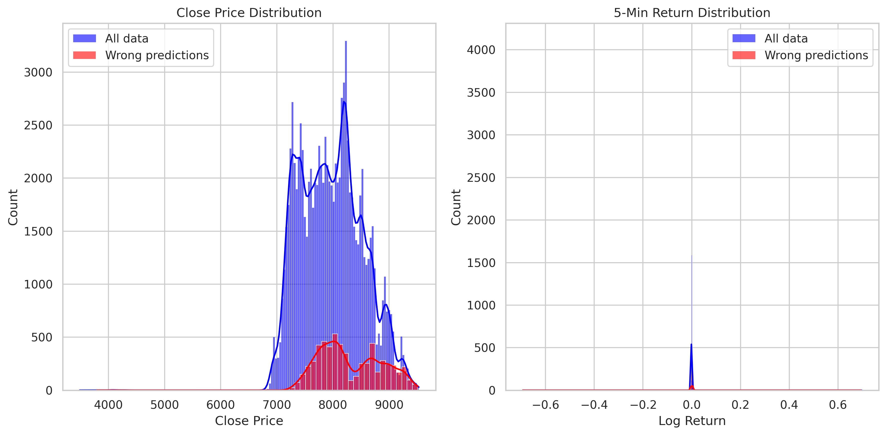
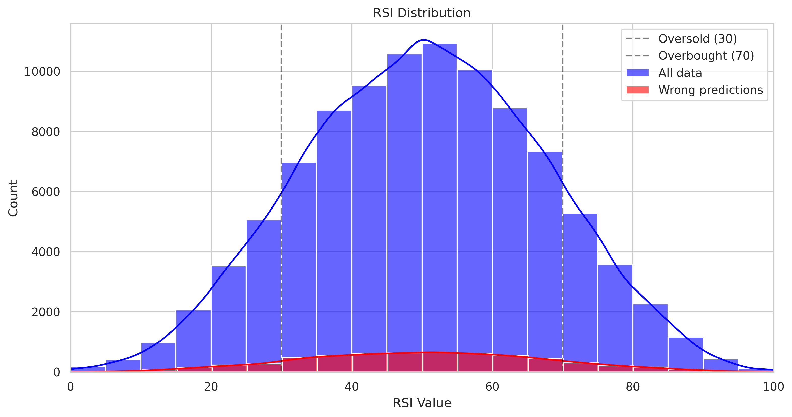
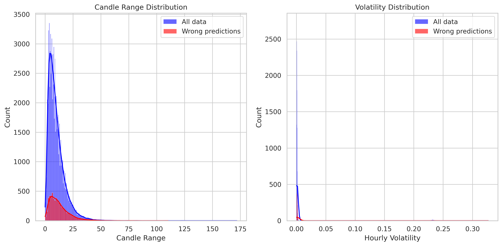
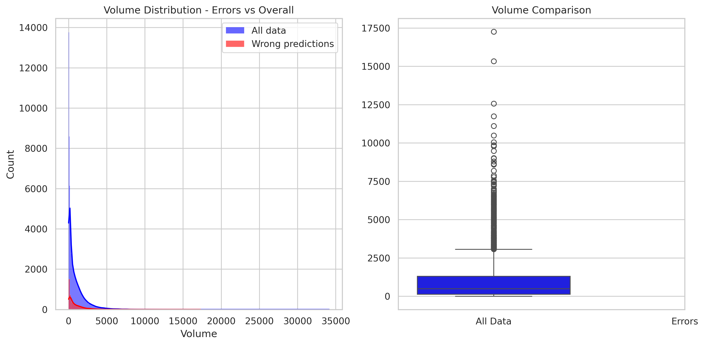

# Trading prediction with machine learning

A system for predicting price movements in financial markets using machine learning. 

This project implements LSTM models to analyze historical price and volume data, integrates numerous technical indicators, and generates trading signals based on the predictions.

## Main features

- Prediction of price direction (up/down) with 73% accuracy
- Analysis of multiple timeframes (5 min, 1h, 4h, 1d)
- Use of advanced technical indicators (RSI, MACD, Bollinger, etc.)
- Generation of trading signals with confidence levels
- Detailed visualization of predictions and error analysis




## Installation and prerequisites

To install all required dependencies:

```bash
# Créer un environnement virtuel
python -m venv myenv

# Activer l'environnement
source myenv/bin/activate  # Linux/Mac
myenv\Scripts\activate     # Windows
```

Pour installer toutes les dépendances requises :

```bash
make setup
```

## Usage

### Model Training

- **Training with default settings**:
```bash
make train
```

- **Training with cross-validation**:
```bash
make train-cv
```

### Entraînement de modèles spécifiques

- **Overall model**:
```bash
make train-ensemble
```

- **Model with attention mechanism**:
```bash
make train-attention
```

- **Bidirectional LSTM model**:
```bash
make train-bidirectional
```

- **Deep LSTM model**:
```bash
make train-deep-lstm
```

### Prédiction

- **Prediction with the last trained model**:
```bash
make predict
```

- **Prediction with a specific model**:
```bash
make predict-ensemble
make predict-attention
make predict-bidirectional
make predict-deep-lstm
```

- **Personalized Prediction**:
```bash
make custom-predict MODEL=attention LIMIT=300 OUTPUT=my_predictions.png
```

### Autres commandes utiles

- **Feature importance analysis**:
```bash
make feature-importance
```

- **Evaluation of the best model**:
```bash
make evaluate
```

- **Start the WebSocket prediction service**:
```bash
make start-service
```

- **Personalized training**:
```bash
make custom-train MODEL=attention EPOCHS=200 BATCH_SIZE=64 SEQUENCE_LEN=32
```

- **Clean generated files**:
```bash
make clean
```

## Results

Our best model achieved the following performance:

- Accuracy: **0.73**
- AUC: **0.73**
- Precision-Recall AUC: **0.80**

Confusion Matrix:

```
precision    recall  f1-score   support
         0       0.73      0.75      0.74      9796
         1       0.74      0.72      0.73      9796
   accuracy                           0.73     19592
  macro avg      0.73      0.73      0.73     19592
weighted avg     0.73      0.73      0.73     19592
```

## Architecture du projet

- `src/model_trainer.py` : Script principal pour l'entraînement des modèles
- `src/predict.py` : Script pour effectuer des prédictions avec les modèles entraînés
- `prediction_service.py` : Service WebSocket pour les prédictions en temps réel

## Modèles disponibles

1. **Ensemble**: Combines multiple models to improve predictions
2. **Attention**: Uses an attention mechanism to identify important patterns
3. **Bidirectional**: Bidirectional LSTM to capture dependencies in both directions
4. **Deep LSTM**: Deep LSTM architecture to model complex relationships

## Analyse des prédictions incorrectes

After training the model, we perform an in-depth analysis of prediction errors to identify recurring patterns and improve performance:

- Generation of a detailed CSV file containing all incorrect predictions
- Classification of errors by category (false positives, false negatives)
- Contextual analysis to identify problematic market conditions
- Detailed visualizations showing the distribution of errors across different variables









## Evolution of scores

Evolution of scores linked to model training

### 1. Nominal

Accuracy: **0.66**, AUC: **0.66**
precision    recall  f1-score   support

           0       0.66      0.71      0.68     10091
           1       0.66      0.61      0.64      9487

    accuracy                           0.66     19578
    macro avg      0.66      0.66      0.66     19578
    weighted avg   0.66      0.66      0.66     19578

Precision-Recall AUC: **0.73**

### 2. Optimisation 1

Accuracy: **0.67**, AUC: **0.67**
precision    recall  f1-score   support

           0       0.68      0.68      0.68     10091
           1       0.66      0.65      0.66      9487

    accuracy                           0.67     19578
    macro avg      0.67      0.67      0.67     19578
    weighted avg   0.67      0.67      0.67     19578

Precision-Recall AUC: **0.74**

### 3. Ajout d'indicateurs

Ajout des indicateurs suivants :

- Keltner_High
- Keltner_Low
- Keltner_Width

#### Résultats

Accuracy: **0.67**, AUC: **0.67**
precision    recall  f1-score   support

           0       0.67      0.70      0.69     10091
           1       0.67      0.64      0.65      9487

    accuracy                           0.67     19578
    macro avg      0.67      0.67      0.67     19578
    weighted avg   0.67      0.67      0.67     19578

Precision-Recall AUC: **0.74**

### 4. Ajout d'indicateurs

Ajout des indicateurs suivants :

- SuperTrend
- ATR_14
- MACD
- Bollinger_High
- Bollinger_Low
- Bollinger_Width
- ADX
- Stoch_RSI
- Williams_R

#### Résultats

Accuracy: **0.68**, AUC: **0.68**
precision    recall  f1-score   support

            0       0.69      0.68      0.69     10091
            1       0.67      0.68      0.67      9487
 
     accuracy                           0.68     19578
    macro avg       0.68      0.68      0.68     19578
    weighted avg    0.68      0.68      0.68     19578

Precision-Recall AUC: **0.75**

### 5. Augmentation batch_size

Augmentation du batch_size de **32** à **64**.

#### Résultats

Accuracy: **0.70**, AUC: **0.70**
precision    recall  f1-score   support

           0       0.70      0.72      0.71     10091
           1       0.69      0.68      0.68      9487

    accuracy                           0.70     19578
    macro avg      0.70      0.70      0.70     19578
    weighted avg   0.70      0.70      0.70     19578

Precision-Recall AUC: **0.76**


### 6. Augmentation batch_size

Augmentation du batch_size de **64** à **128**.

#### Résultats

Accuracy: **0.73**, AUC: **0.73**
precision    recall  f1-score   support

           0       0.74      0.73      0.73     10073
           1       0.72      0.72      0.72      9419

    accuracy                           0.73     19492
    macro avg      0.73      0.73      0.73     19492
    weighted avg   0.73      0.73      0.73     19492

Precision-Recall AUC: **0.78**


### 7.  Changer le taux d'apprentissage - decrease score

Changer le taux d'apprentissage de **0.001** à **0.0005**.

#### Résultats

Accuracy: **0.72**, AUC: **0.72**
precision    recall  f1-score   support

           0       0.73      0.71      0.72     10073
           1       0.70      0.72      0.71      9419

    accuracy                           0.72     19492
    macro avg      0.72      0.72      0.72     19492
    weighted avg   0.72      0.72      0.72     19492

Precision-Recall AUC: **0.78**


### 8.  Ajout de couches LSTM supplémentaire

Ajout d'une couche LSTM supplémentaire.


#### Résultats

Accuracy: 0.70, AUC: 0.70
precision    recall  f1-score   support

           0       0.70      0.74      0.72     10073
           1       0.70      0.66      0.68      9419

    accuracy                           0.70     19492
    macro avg      0.70      0.70      0.70     19492
    weighted avg   0.70      0.70      0.70     19492

Precision-Recall AUC: 0.76


### 9.  Ajout de tendances RSI supplémentaires

- Ajout de moyennes mobiles sur le RSI
- Ajout de tendances sur le RSI
- Ajout de signaux de croisement RSI / Moyenne mobile

#### Résultats

Accuracy: 0.71, AUC: 0.71
precision    recall  f1-score   support

           0       0.71      0.73      0.72     10073
           1       0.70      0.69      0.70      9419

    accuracy                           0.71     19492
    macro avg      0.71      0.71      0.71     19492
    weighted avg   0.71      0.71      0.71     19492

Precision-Recall AUC: 0.77


### 10. Test de la pertinence de chaque champs "leave-one-feature-out"

Boucle pour tester chaque champs en le retirant du dataset.

Champs retirés :
- EMA_10
- SuperTrend_Direction

#### Résultats

Accuracy: 0.70, AUC: 0.70
precision    recall  f1-score   support

           0       0.71      0.73      0.72     10073
           1       0.70      0.68      0.69      9419

    accuracy                           0.70     19492
    macro avg      0.70      0.70      0.70     19492
    weighted avg   0.70      0.70      0.70     19492

Precision-Recall AUC: 0.76

### 11.  Nouvel essai

Champs retirés :
- SuperTrend_Direction

#### Résultats


Accuracy: 0.72, AUC: 0.72
precision    recall  f1-score   support

           0       0.73      0.72      0.72     10073
           1       0.70      0.71      0.71      9419

    accuracy                           0.72     19492
    macro avg      0.71      0.72      0.71     19492
    weighted avg   0.72      0.72      0.72     19492

Precision-Recall AUC: 0.78

### 12.  Augmentation batch_size

Augmentation du batch_size de **128** à **256**.

#### Résultats

Accuracy: 0.72, AUC: 0.72
precision    recall  f1-score   support

           0       0.73      0.72      0.73     10073
           1       0.71      0.72      0.71      9419

    accuracy                           0.72     19492
    macro avg      0.72      0.72      0.72     19492
    weighted avg   0.72      0.72      0.72     19492

Precision-Recall AUC: 0.78


### 13. Annealing learning rate schedule, en diminuant progressivement le taux d’apprentissage au fil des epochs :


```python
from tensorflow.keras.callbacks import ReduceLROnPlateau
reduce_lr = ReduceLROnPlateau(monitor='val_loss', factor=0.5, patience=3, min_lr=1e-6)
```


#### Résultats

Accuracy: 0.68, AUC: 0.68
precision    recall  f1-score   support

           0       0.69      0.69      0.69     10073
           1       0.67      0.67      0.67      9419

    accuracy                           0.68     19492
    macro avg      0.68      0.68      0.68     19492
    weighted avg   0.68      0.68      0.68     19492

Precision-Recall AUC: 0.75


### 14. Ajout RSI_SMA_7 et RSI_Trend


#### Résultats

Accuracy: 0.73, AUC: 0.73
precision    recall  f1-score   support

           0       0.73      0.76      0.75     10193
           1       0.73      0.69      0.71      9465

    accuracy                           0.73     19658
    macro avg      0.73      0.73      0.73     19658
    weighted avg   0.73      0.73      0.73     19658

Precision-Recall AUC: 0.79


### 15. Ajoute du Dropout supplémentaire (ou augmente le taux de Dropout existant).

#### Résultats

Accuracy: 0.72, AUC: 0.72
precision    recall  f1-score   support

           0       0.73      0.73      0.73     10193
           1       0.71      0.72      0.71      9465

    accuracy                           0.72     19658
    macro avg      0.72      0.72      0.72     19658
    weighted avg   0.72      0.72      0.72     19658

Precision-Recall AUC: 0.78

### 16. Diminution de la période a prevoir

- le modèle essaie bien de prédire la direction de la bougie suivante (ou plus exactement, la direction du prix après 5 bougies). Tu peux ajuster cette période si nécessaire (par exemple, tester shift(-1) au lieu de shift(-5)).


#### Résultats avec une prévision à 20 minutes

Accuracy: **0.67**, AUC: **0.67**
precision    recall  f1-score   support

           0       0.68      0.68      0.68     10172
           1       0.66      0.66      0.66      9486

    accuracy                           0.67     19658
    macro avg      0.67      0.67      0.67     19658
    weighted avg   0.67      0.67      0.67     19658

Precision-Recall AUC: **0.74**


#### Résultats avec une prévision à 25 minutes

Accuracy: **0.72**, AUC: **0.72**
precision    recall  f1-score   support

           0       0.73      0.73      0.73     10193
           1       0.71      0.72      0.71      9465

    accuracy                           0.72     19658
    macro avg      0.72      0.72      0.72     19658
    weighted avg   0.72      0.72      0.72     19658

Precision-Recall AUC: **0.78**


#### Résultats avec une prévision à 35 minutes

Accuracy: **0.75**, AUC: **0.75**
precision    recall  f1-score   support

           0       0.76      0.75      0.76     10156
           1       0.74      0.75      0.74      9502

    accuracy                           0.75     19658
    macro avg      0.75      0.75      0.75     19658
    weighted avg   0.75      0.75      0.75     19658

Precision-Recall AUC: **0.80**


#### Résultats avec une prévision à 1 heure

Accuracy: **0.83**, AUC: **0.83**
precision    recall  f1-score   support

           0       0.84      0.83      0.84      9982
           1       0.83      0.83      0.83      9676

    accuracy                           0.83     19658
    macro avg      0.83      0.83      0.83     19658
    weighted avg   0.83      0.83      0.83     19658

Precision-Recall AUC: **0.87**


### 17. Ajout du candle_trend

#### Résultats avec une prévision à 20 minutes (shift 4)

Accuracy: **0.67**, AUC: **0.67**
precision    recall  f1-score   support

           0       0.69      0.67      0.68     10172
           1       0.66      0.68      0.67      9486

    accuracy                           0.67     19658
    macro avg      0.67      0.67      0.67     19658
    weighted avg   0.67      0.67      0.67     19658

Precision-Recall AUC: **0.75**

Wrong_predictions : **6405**


### 18. Ajout du doji

#### Résultats

Accuracy: **0.66**, AUC: **0.66**
precision    recall  f1-score   support

           0       0.67      0.68      0.67     10172
           1       0.65      0.63      0.64      9486

    accuracy                           0.66     19658
    macro avg      0.66      0.66      0.66     19658
    weighted avg   0.66      0.66      0.66     19658

Precision-Recall AUC: **0.73**

Wrong_predictions : **6765**

### 19. Ajout du 'same_direction'

#### Résultats

Accuracy: **0.66**, AUC: **0.66**
precision    recall  f1-score   support

           0       0.68      0.66      0.67     10172
           1       0.65      0.66      0.66      9486

    accuracy                           0.66     19658
    macro avg      0.66      0.66      0.66     19658
    weighted avg   0.66      0.66      0.66     19658

Precision-Recall AUC: **0.74**

Wrong_predictions : **6637**


### 20.  Ajout du 'bullish_engulfing' et 'bearish_engulfing'

#### Résultats  à 20 minutes

Nombre d'erreurs détectées : **7015**

Accuracy: 0.64, AUC: 0.64
precision    recall  f1-score   support

           0       0.66      0.63      0.65     10172
           1       0.62      0.66      0.64      9486

    accuracy                           0.64     19658
    macro avg      0.64      0.64      0.64     19658
    weighted avg   0.64      0.64      0.64     19658

Precision-Recall AUC: **0.72**


### 21. Ajout du 'market_open_hour', 'stock_open_hour',  'is_summer', et suppression de 'year', 'month'

#### Résultats

Nombre d'erreurs détectées : **6352**

Accuracy: **0.68**, AUC: **0.68**
precision    recall  f1-score   support

           0       0.68      0.70      0.69     10172
           1       0.67      0.65      0.66      9486

    accuracy                           0.68     19658
    macro avg      0.68      0.68      0.68     19658
    weighted avg   0.68      0.68      0.68     19658

Precision-Recall AUC: **0.74**


### 22. Ajout de 'sin_day', 'cos_day', 'sin_hour', 'cos_hour', 'period_of_day', 'hourly_return', 'volatility_by_period', 'hourly_volatility'


#### Résultatse prévision à 20 minutes


Nombre d'erreurs détectées : 6188
Accuracy: 0.69, AUC: 0.68
precision    recall  f1-score   support

           0       0.69      0.71      0.70     10172
           1       0.68      0.66      0.67      9486

    accuracy                           0.69     19658
    macro avg      0.68      0.68      0.68     19658
    weighted avg   0.69      0.69      0.68     19658

Precision-Recall AUC: **0.75**


#### Résultats avec une prévision à 20 minutes


Nombre d'erreurs détectées : **6104**
Accuracy: **0.69**, AUC: **0.69**
precision    recall  f1-score   support

           0       0.70      0.70      0.70     10270
           1       0.68      0.67      0.67      9378

    accuracy                           0.69     19648
    macro avg      0.69      0.69      0.69     19648
    weighted avg   0.69      0.69      0.69     19648

Precision-Recall AUC: **0.75**


#### Résultats avec une prévision à 20 minutes


Nombre d'erreurs détectées : **6096**

Accuracy: **0.69**, AUC: **0.69**
precision    recall  f1-score   support

           0       0.71      0.69      0.70     10270
           1       0.67      0.69      0.68      9378

    accuracy                           0.69     19648
    macro avg      0.69      0.69      0.69     19648
    weighted avg   0.69      0.69      0.69     19648

Precision-Recall AUC: **0.75**


### 23. Utilisation de moins de données


#### Résultats avec une prévision à 20 minutes

Accuracy: **0.68**, AUC: **0.68**
precision    recall  f1-score   support

           0       0.69      0.67      0.68      6708
           1       0.67      0.70      0.69      6620

    accuracy                           0.68     13328
    macro avg      0.68      0.68      0.68     13328
    weighted avg   0.68      0.68      0.68     13328

Precision-Recall AUC: **0.76**


Accuracy: **0.69**, AUC: **0.69**
precision    recall  f1-score   support

           0       0.69      0.68      0.69      8814
           1       0.69      0.69      0.69      8840

    accuracy                           0.69     17654
    macro avg      0.69      0.69      0.69     17654
    weighted avg   0.69      0.69      0.69     17654

Precision-Recall AUC: **0.77**


Accuracy: **0.67**, AUC: **0.67**
precision    recall  f1-score   support

           0       0.66      0.69      0.68     12667
           1       0.67      0.65      0.66     12569

    accuracy                           0.67     25236
    macro avg      0.67      0.67      0.67     25236
    weighted avg   0.67      0.67      0.67     25236

Precision-Recall AUC: **0.75**

#### Résultats avec une prévision à 20 minutes

Accuracy: **0.70**, AUC: **0.70**
precision    recall  f1-score   support

           0       0.70      0.69      0.70      9796
           1       0.69      0.70      0.70      9796

    accuracy                           0.70     19592
    macro avg      0.70      0.70      0.70     19592
    weighted avg   0.70      0.70      0.70     19592

Precision-Recall AUC: **0.77**


### 24.  Utilisation des volumes


#### Résultats avec une prévision à 20 minutes

Accuracy: **0.70**, AUC: **0.70**
precision    recall  f1-score   support

           0       0.71      0.70      0.70      9796
           1       0.70      0.71      0.71      9796

    accuracy                           0.70     19592
    macro avg      0.70      0.70      0.70     19592
    weighted avg   0.70      0.70      0.70     19592

Precision-Recall AUC: **0.78**

### 25. Utilisation de les timelines 1h, 4h, 1d

#### Résultats avec une prévision à 20 minutes

Accuracy: **0.71**, AUC: **0.71**
precision    recall  f1-score   support

           0       0.71      0.70      0.71      9796
           1       0.70      0.71      0.71      9796

    accuracy                           0.71     19592
    macro avg      0.71      0.71      0.71     19592
    weighted avg   0.71      0.71      0.71     19592

Precision-Recall AUC: **0.78**


### 26. Ajout de volume ratio 1h_volume_ratio, 4h_volume_ratio, 1d_volume_ratio

#### Résultats avec une prévision à 20 minutes

Accuracy: **0.71**, AUC: **0.71**
precision    recall  f1-score   support

           0       0.72      0.70      0.71      9796
           1       0.71      0.72      0.72      9796

    accuracy                           0.71     19592
    macro avg      0.71      0.71      0.71     19592
    weighted avg   0.71      0.71      0.71     19592

Precision-Recall AUC: **0.78**


### 27. Ajout de close_over_1h_SMA, close_over_4h_SMA, close_over_1d_SMA

#### Résultats avec une prévision à 20 minutes

Accuracy: **0.71**, AUC: **0.71**
precision    recall  f1-score   support

           0       0.72      0.70      0.71      9796
           1       0.71      0.73      0.72      9796

    accuracy                           0.71     19592
    macro avg      0.71      0.71      0.71     19592
    weighted avg   0.71      0.71      0.71     19592

Precision-Recall AUC: **0.78**

### 28. Ajout de 1h_trend, 4h_trend, 1d_trend

#### Résultats avec une prévision à 20 minutes

Accuracy: **0.71**, AUC: **0.71**
precision    recall  f1-score   support

           0       0.71      0.72      0.72      9796
           1       0.72      0.71      0.71      9796

    accuracy                           0.71     19592
    macro avg      0.71      0.71      0.71     19592
    weighted avg   0.71      0.71      0.71     19592

Precision-Recall AUC: **0.79**

### 29. Ajout de bullish_alignment et bearish_alignment, mixed_trend_signals

#### Résultats avec une prévision à 20 minutes

Accuracy: **0.72**, AUC: **0.72**
precision    recall  f1-score   support

           0       0.73      0.71      0.72      9796
           1       0.72      0.73      0.73      9796

    accuracy                           0.72     19592
    macro avg      0.72      0.72      0.72     19592
    weighted avg   0.72      0.72      0.72     19592

Precision-Recall AUC: **0.79**

### 30. Optimisation des paramètres avec "optuna"


#### Résultats avec une prévision à 20 minutes

Accuracy: **0.73**, AUC: **0.73**
precision    recall  f1-score   support

           0       0.73      0.75      0.74      9796
           1       0.74      0.72      0.73      9796

    accuracy                           0.73     19592
    macro avg      0.73      0.73      0.73     19592
    weighted avg   0.73      0.73      0.73     19592

Precision-Recall AUC: **0.80**

